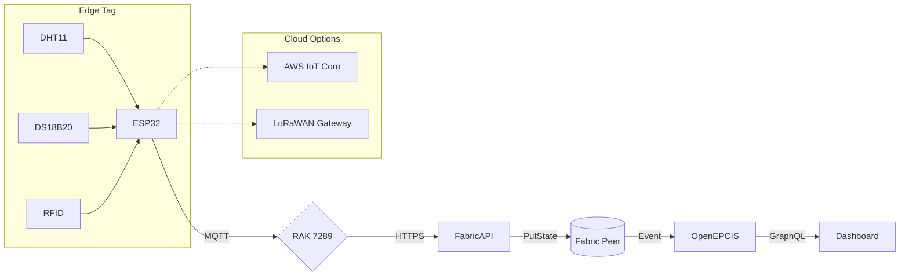

# Scain • Low‑Cost Food Traceability MVP

A proof‑of‑concept pallet tag and ledger stack that **meets FSMA §204 (U.S.) and SFCR Part 5 (Canada)** traceability rules using a ₹1 500 hardware kit.

---

## 🚀 Quick Start

### Web Dashboard
```bash
# Clone and install dependencies
git clone https://github.com/your-org/scain.git
cd scain
npm install

# Start development server
npm run dev
```
Visit [http://localhost:3000](http://localhost:3000) for the dashboard.

### Chaincode (Go)
```bash
# Run chaincode tests
cd chaincode
go test ./...

# Or use the convenience script
npm run test:go
```

### Firmware (ESP32)
```bash
# Flash ESP32 firmware (requires ESP-IDF)
make flash

# Or compile only
cd src/firmware && idf.py build
```

### Full Development Environment
```bash
# Setup everything (blockchain network, MQTT, etc.)
make setup
make devnet
```

---

## 💰 Bill of Materials

### Pilot Configuration (₹1 500)

| Qty | Part | Price (₹) | Purpose |
|-----|------|-----------|---------|
| 1 | ESP32‑DevKitC‑32D (Wi‑Fi/BLE) | 630 | Main controller |
| 1 | DHT11 Temp/Humidity module | 225 | Air monitoring |
| 1 | DS18B20 waterproof probe | 335 | Product temperature |
| 1 | Alien H3 UHF RFID inlay | 43 | Identity tag |
| 1 | Enclosure + wiring | 267 | Protection |
| — | **Total / pallet** | **₹1 500** | |

### Enterprise Configuration (₹6 000)

| Qty | Part | Price (₹) | Purpose |
|-----|------|-----------|---------|
| 1 | Heltec LoRa‑32 V3 | 1 200 | Long-range connectivity |
| 1 | Milesight EM320‑TH (IP67, EN12830) | 3 500 | Certified sensors |
| 1 | TempDot Plus TTI label | 150 | Single-use indicator |
| 1 | ESP32‑C3 AWS ExpressLink | 800 | Secure cloud |
| 1 | IP67 industrial enclosure | 350 | Weather protection |
| — | **Total / pallet** | **₹6 000** | |

*Cost reduction: 75% vs. traditional solutions*

---

## 🏗️ Architecture



**Long‑range option**: Heltec LoRa‑32 V3 for > 10 km LoRaWAN uplink.  
**Secure link**: AWS IoT ExpressLink on ESP32‑C3 module handles TLS & fleet OTA.

---

## 📁 Project Structure

```
Scain/
├── src/
│   ├── firmware/           # ESP32 Arduino/ESP-IDF code
│   │   ├── main.cpp       # Main sensor loop
│   │   ├── awslink.cpp    # AWS ExpressLink wrapper
│   │   └── awslink.h      # Header file
│   └── tests/             # Unit tests
│       └── chaincode_test.go
├── chaincode/             # Hyperledger Fabric smart contract
│   ├── put_state.go       # Main chaincode
│   └── go.mod            # Go dependencies
├── web/                   # Next.js 14 dashboard
│   ├── app/              # App router pages
│   ├── components/       # React components
│   └── lib/              # Utilities and hooks
├── config/               # Configuration files
├── docker/               # Docker build files
├── scripts/              # Deployment scripts
├── docs/                 # Documentation
├── docker-compose.yml    # Development stack
└── Makefile             # Build targets
```

---

## 🔧 Firmware Quick Start

### Prerequisites
- ESP-IDF v5.1+
- Arduino component installed

### Build & Flash
```bash
# Set target and configure
idf.py set-target esp32
idf.py menuconfig   # enable Wi‑Fi, BLE, secure‑boot

# Build and flash
idf.py build -p /dev/ttyUSB0 flash monitor
```

### Data Payload (EPCIS 2.0)
```json
{
  "@context": "https://ref.gs1.org/standards/epcis/2.0.0/epcis-context.jsonld",
  "type": "EPCISDocument",
  "schemaVersion": "2.0",
  "creationDate": "2025-01-15T12:34:00Z",
  "epcisBody": {
    "eventList": [{
      "eventType": "ObjectEvent",
      "eventTime": "2025-01-15T12:34:00Z",
      "epcList": ["urn:epc:id:sgtin:0614141.KG-ESP32-001"],
      "action": "OBSERVE",
      "bizStep": "urn:epcglobal:cbv:bizstep:sensor_reporting",
      "sensorElementList": [{
        "sensorMetadata": {
          "deviceID": "KG-ESP32-001",
          "time": "2025-01-15T12:34:00Z"
        },
        "sensorReport": [
          {
            "type": "gs1:Temperature",
            "value": 4.9,
            "uom": "CEL",
            "component": "probe"
          },
          {
            "type": "gs1:Temperature", 
            "value": 7.3,
            "uom": "CEL",
            "component": "air"
          }
        ]
      }]
    }]
  }
}
```

---

## ⛓️ Chaincode (Hyperledger Fabric)

### Core Functions
```go
// Store EPCIS event with SHA-256 hash
func RecordEvent(ctx contractapi.TransactionContextInterface, epcisJSON string) error

// Retrieve event by hash
func GetEvent(ctx contractapi.TransactionContextInterface, hash string) (*TraceabilityRecord, error)

// Query events by device ID
func GetEventsByDevice(ctx contractapi.TransactionContextInterface, deviceID string) ([]*QueryResult, error)

// Get recent events (up to 100)
func GetRecentEvents(ctx contractapi.TransactionContextInterface, limit int) ([]*QueryResult, error)
```

### Deploy
```bash
# Package chaincode
make chaincode-package

# Install and deploy
make chaincode-deploy
```

---

## 🐳 Docker Stack

### Services
- **Mosquitto**: MQTT broker (1883, 9001)
- **Fabric Peer**: Blockchain ledger (7051)
- **CouchDB**: State database (5984)
- **OpenEPCIS**: EPCIS 2.0 repository (8080)
- **Dashboard**: Next.js UI (3000)
- **Fabric REST API**: HTTP gateway (4000)

### Commands
```bash
# Start all services
docker-compose up -d

# View logs
docker-compose logs -f

# Stop and clean
docker-compose down -v
```

---

## 🎯 Dashboard Features

### Real-time Monitoring
- Live sensor readings (temperature, humidity)
- MQTT connection status
- Temperature alarm notifications
- Trend visualization (24h history)

### Compliance Tracking
- FSMA §204 critical tracking events
- SFCR Part 5 lot code generation
- EPCIS 2.0 event validation
- Audit trail with <24h retrieval

### TempDot Integration
- Visual temperature indicators
- Breach detection and alerts
- Historical temperature abuse

---

## 📊 Compliance Matrix

| Regulation | Requirement | Scain Implementation |
|------------|-------------|--------------------------|
| **FSMA §204** | 16 Critical Tracking Events | ✅ Captured via EPCIS JSON |
| | <24h data retrieval | ✅ Indexed by device/EPC |
| | Lot-level traceability | ✅ GS1 SGTIN format |
| | Sortable spreadsheet | ✅ CSV export available |
| **SFCR Part 5** | CFIA-compliant lot codes | ✅ Generated automatically |
| | One-up/one-down records | ✅ Composite key indexing |
| | 2+ year retention | ✅ Blockchain immutability |
| **EN 12830** | Certified sensors | ✅ Milesight EM320-TH (enterprise) |
| | Temperature mapping | ✅ Continuous monitoring |
| | Calibration records | ✅ Device metadata stored |

---

## 🧪 Testing

### Run All Tests
```bash
make test
```

### Individual Test Suites
```bash
# Chaincode tests
make test-chaincode

# Dashboard tests  
make test-dashboard

# Firmware build test
make test-firmware
```

### Test Coverage
- SHA-256 hashing validation
- EPCIS JSON parsing
- Fabric client operations
- Sensor data extraction
- React component rendering

---

## 🚀 Deployment

### Development
```bash
make devnet
make dashboard
```

### Production
```bash
make deploy-prod
```

### Monitoring
```bash
make monitor
make logs
make status
```

---

## 🛠️ Configuration

### MQTT Broker
```bash
make config-mosquitto
```

### Fabric Network
```bash
make config-fabric
```

### SSL Certificates
```bash
make generate-certs
```

---

## 📈 Roadmap

### v0.1 (Current)
- ✅ Pilot lane, Wi‑Fi only
- ✅ Manual dashboard
- ✅ Basic EPCIS compliance

### v0.2 (Q2 2025)
- 🔄 LoRaWAN + LTE back‑haul
- 🔄 Auto‑recall drill timer
- 🔄 Mobile app companion

### v1.0 (Q3 2025)
- 🔄 Industrial IP‑67 enclosure
- 🔄 Secure‑boot enabled
- 🔄 SOC‑2 documentation
- 🔄 Multi-tenant dashboard

---

## 🤝 Contributing

1. Fork the repository
2. Create feature branch (`git checkout -b feature/amazing-feature`)
3. Commit changes (`git commit -m 'Add amazing feature'`)
4. Push to branch (`git push origin feature/amazing-feature`)
5. Open Pull Request

---

## 📄 License

This project is licensed under the MIT License - see the [LICENSE](LICENSE) file for details.

---

## 🆘 Support

- **Documentation**: [Wiki](https://github.com/Antimatters-Technology/Scain/wiki)
- **Issues**: [GitHub Issues](https://github.com/Antimatters-Technology/Scain/issues)
- **Discussions**: [GitHub Discussions](https://github.com/Antimatters-Technology/Scain/discussions)
- **Email**: support@scain.io

---

## 🏆 Acknowledgments

- Hyperledger Fabric community
- GS1 EPCIS working group
- ESP-IDF team
- Next.js team
- Open source contributors

---

**Built with ❤️ for food safety and traceability**
