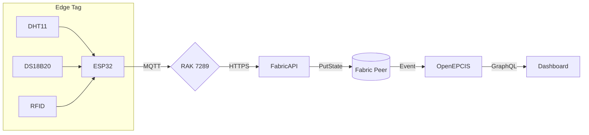

# Scain • Low‑Cost Food Traceability MVP

A proof‑of‑concept pallet tag and ledger stack that **meets FSMA §204 (U.S.) and SFCR Part 5 (Canada)** traceability rules using a ₹1 200 hardware kit.

---

## 1 Hardware Bill of Materials (pilot)

| Qty | Part | Price (₹) |
|-----|------|-----------|
| 1 | ESP32‑DevKitC‑32D (Wi‑Fi/BLE) | 630 |
| 1 | DHT11 Temp/Humidity module | 225 |
| 1 | DS18B20 waterproof probe | 335 |
| 1 | Passive UHF RFID inlay | 43 |
| — | **Total / pallet** | **1 233** |

*Upgrade path*: swap sensors for Milesight EM320‑TH (IP‑67, EN 12830, FDA) when deploying at scale. 

---

## 2 Architecture ▲


Long‑range option: Heltec LoRa‑32 V3 for > 5 km LoRa uplink.
Secure link: AWS IoT ExpressLink on ESP32‑C3 module handles TLS & fleet OTA.

---

## 3 Firmware Quick Start

1. Install ESP‑IDF with Arduino component
2. ```sh
   idf.py set-target esp32
   idf.py menuconfig   # enable Wi‑Fi, BLE, secure‑boot
   idf.py build -p /dev/ttyUSB0 flash monitor
   ```
3. Data payload (JSON):

```json
{
  "lot": "KG-{{EPC}}",
  "airTemp": 7.3,
  "probeTemp": 4.9,
  "ts": "2025-07-15T12:34:00Z"
}
```

---

## 4 Chain‑code stub

```go
func RecordEvent(ctx contractapi.TransactionContextInterface, epcis string) error {
    hash := sha256.Sum256([]byte(epcis))
    return ctx.GetStub().PutState(fmt.Sprintf("%x", hash), []byte(epcis))
}
```

---

## 5 Docker Stack

```sh
docker compose up -d
# services: mosquitto, fabric-peer, couchdb, openepcis, nextjs-dashboard
```

---

## 6 Compliance Matrix

| Rule         | How KnowGraph meets it |
|--------------|-----------------------|
| FSMA §204    | Captures 16 Critical Tracking Events → EPCIS JSON → retrievable < 24 h. |
| SFCR Part 5  | Generates CFIA‑compliant Lot Code & one‑up/one‑down records. |
| EN 12830 (upgrade) | EM320‑TH sensor is certified. |

---

## 7 Roadmap

- v0.1 Pilot lane, Wi‑Fi only, manual dashboard.
- v0.2 LoRaWAN + LTE back‑haul, auto‑recall drill timer.
- v1.0 Industrial IP‑67 enclosure, secure‑boot, SOC‑2 docs.
