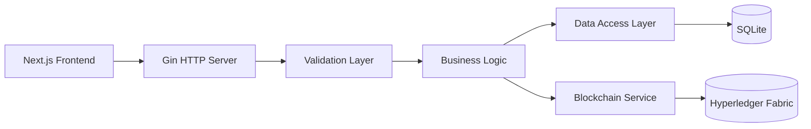

# Scain Architecture Overview

## 🏗️ System Architecture

Scain implements a modern, modular architecture for food traceability using **Go** backend services, **Next.js** frontend, **Hyperledger Fabric** blockchain, and **ESP32 firmware** for IoT integration.

### Technology Stack

#### Backend (Go)
- **Runtime**: Go 1.21+
- **HTTP Framework**: Gin
- **Validation**: go-playground/validator
- **Logging**: logrus 
- **Configuration**: godotenv
- **Hashing**: Built-in crypto libraries
- **Blockchain**: Hyperledger Fabric SDK Go

#### Frontend (Next.js)
- **Framework**: Next.js 14+ with App Router
- **Language**: TypeScript
- **Styling**: Tailwind CSS
- **UI Components**: shadcn/ui
- **State Management**: React hooks

#### Data Layer
- **Database**: SQLite (production-ready), PostgreSQL (planned)
- **Caching**: Redis (planned) 
- **Blockchain**: Hyperledger Fabric (production-ready)

#### IoT Firmware
- **Platform**: ESP32 (Arduino/PlatformIO)
- **Sensors**: DHT11, DS18B20, RFID
- **Protocols**: MQTT, HTTP, AWS ExpressLink
- **EPCIS 2.0**: Native event generation

## 📦 Project Structure

```
scain/
├── backend/                    # Go backend service (with blockchain integration)
│   ├── main.go                # Application entry point
│   ├── services/              # Business logic (EPCIS, devices, blockchain)
│   ├── models/                # Data models and structs
│   ├── database/              # SQLite operations
│   ├── middleware/            # HTTP validation and security
│   └── utils/                 # Cryptographic utilities
├── frontend/                   # Next.js frontend
│   ├── app/                   # Next.js App Router pages
│   ├── components/            # React components
│   └── lib/                   # Client utilities
├── blockchain/                 # Hyperledger Fabric integration
│   ├── chaincode/             # Smart contracts (Go)
│   └── network/               # Fabric network setup scripts
├── firmware/                   # ESP32 firmware (C++/PlatformIO)
│   ├── main.cpp               # Main firmware code
│   ├── config.h               # Configurable settings
│   └── platformio.ini         # Build configuration
└── docs/                      # Documentation
```

## 🔄 Data Flow Architecture

### End-to-End Event Flow

```mermaid
graph TD
    A[ESP32 IoT Devices] --> B[Raw Data Ingestion (HTTP/MQTT)]
    B --> C[Go Backend Validation]
    C --> D[EPCIS Event Creation]
    D --> E[Hash Computation]
    E --> F[Database Storage (SQLite)]
    F --> G[Blockchain Submission (Fabric)]
    G --> H[Hyperledger Fabric Ledger]
    D --> I[Frontend Dashboard]
```

### API & Blockchain Architecture



## 🎯 Core Components

### Backend Services (Go)

#### EPCIS Event Manager
- **Purpose**: Handle supply chain traceability events
- **Models**: `EpcisEvent`, `SensorElement`, `DeviceMetadata`
- **Endpoints**: 
  - `POST /api/events` - Create new EPCIS event (anchored on blockchain)
  - `GET /api/events/:id` - Retrieve event by ID
  - `GET /api/events/:id/verify` - Verify event on blockchain
  - `GET /api/events/:id/history` - Blockchain transaction history

#### Device Manager
- **Purpose**: Manage IoT device registration and metadata
- **Models**: `DeviceInfo`, `ClaimCode`
- **Endpoints**:
  - `POST /api/devices` - Register new device
  - `GET /api/devices/:deviceId` - Get device information
  - `POST /api/claim` - Claim device with code

#### Data Ingestion Service
- **Purpose**: Process raw IoT data into standardized events
- **Models**: `RawIngestPayload`
- **Endpoints**:
  - `POST /api/ingest` - Ingest raw device data

#### Blockchain Service
- **Purpose**: Anchor events on Hyperledger Fabric, verify integrity
- **Integration**: Fabric Go SDK, chaincode smart contracts
- **Endpoints**:
  - `GET /api/events/:id/verify` - Verify event on blockchain
  - `GET /api/events/:id/history` - Blockchain transaction history

#### Utility Services
- **Hash Service**: Cryptographic hash computation for data integrity
- **Canonical JSON**: Deterministic JSON serialization for consistent hashing

### Frontend Components (Next.js)

#### Dashboard
- Real-time supply chain visibility
- Event timeline visualization
- Device status monitoring
- Blockchain verification for events

#### Admin Interface
- Device management
- System configuration
- User administration

### Firmware (ESP32)
- **Sensor Integration**: Reads DHT11, DS18B20, RFID
- **EPCIS Event Generation**: Native EPCIS 2.0 JSON
- **Protocols**: MQTT, HTTP, AWS ExpressLink
- **Configurable**: WiFi, API, MQTT via `config.h`
- **Power Management**: Deep sleep, OTA-ready

### Blockchain (Hyperledger Fabric)
- **Chaincode**: Smart contracts for event storage and verification
- **Network**: Local/testnet setup scripts
- **Integration**: Backend submits events, stores TX IDs
- **Verification**: API endpoints for proof and history

## 🔒 Security Architecture

### Data Integrity
- **SHA256 Hashing**: All events hashed for tamper detection
- **Canonical JSON**: Deterministic serialization ensures consistent hashes
- **Blockchain Immutability**: Events anchored on Fabric
- **Validation**: Go struct validation with tags

### Authentication & Authorization
- **JWT Tokens**: Stateless authentication (planned)
- **RBAC**: Role-based access control (planned)
- **Device Certificates**: IoT device authentication (planned)

## 🚀 Deployment Architecture

### Development
- **Go Backend**: `go run .` for development
- **Frontend**: `npm run dev` with hot reload
- **Fabric Network**: `./blockchain/network/setup.sh` for local blockchain
- **Firmware**: `pio run --target upload` for ESP32
- **Concurrency**: All services run simultaneously

### Production
- **Backend**: Compiled Go binary
- **Frontend**: Static site generation with Next.js
- **Blockchain**: Fabric on cloud or managed service
- **Firmware**: OTA updates supported
- **Containerization**: Docker containers (ready)
- **Orchestration**: Kubernetes/Docker Compose (planned)

## 📊 Performance Considerations

### Backend (Go)
- **Concurrency**: Native goroutines for high throughput
- **Memory**: Low memory footprint vs Node.js
- **CPU**: Compiled binary performance
- **Scalability**: Horizontal scaling ready

### Data Processing
- **Batch Processing**: For high-volume device data
- **Real-time Streaming**: Event-driven updates
- **Caching Strategy**: Redis for frequently accessed data

## 🔮 Future Architecture

### Planned Enhancements
- **Database Integration**: PostgreSQL with GORM
- **Message Queuing**: RabbitMQ/Kafka for event streaming  
- **Microservices**: Split into focused services
- **API Gateway**: Centralized routing and auth
- **Observability**: Metrics, logging, and tracing

### Blockchain Enhancements
- **Smart Contracts**: Event validation and storage (production-ready)
- **Consensus**: Ensure data immutability
- **Interoperability**: Cross-chain compatibility
- **Advanced Analytics**: On-chain event queries

### Firmware Enhancements
- **OTA Updates**: Remote firmware management
- **Edge Processing**: Local event filtering
- **Additional Sensors**: Expand hardware support 