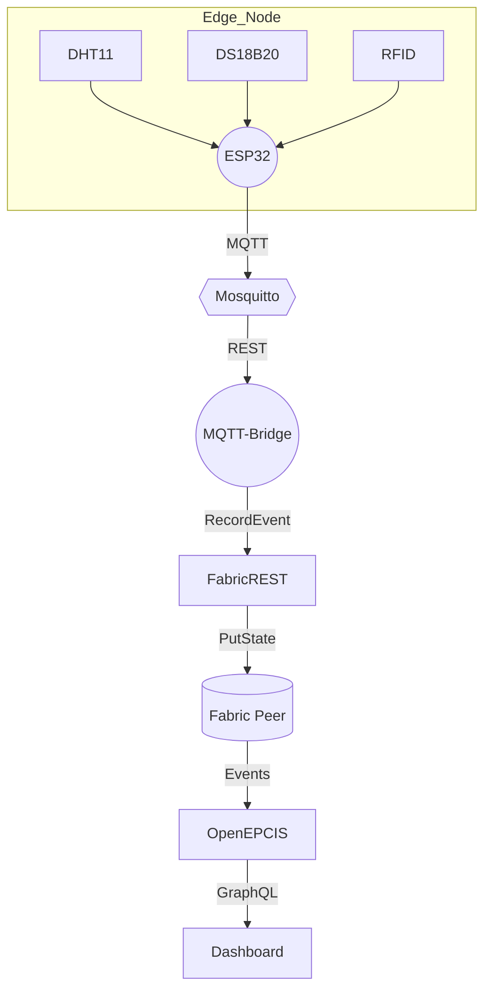

# 🏗️ Architecture Overview

Scain is a **sensor-to-ledger** platform that bridges low-cost hardware with enterprise-grade traceability services.

## Components

| Layer | Service | Technology | Purpose |
|-------|---------|------------|---------|
| Edge  | ESP32 Firmware | C++17 on ESP-IDF / Arduino | Collects temp & humidity every 5 min, publishes EPCIS JSON over MQTT. |
| Gateway | Mosquitto | Eclipse Mosquitto 2.0 | Secure local MQTT broker (1883 / 9001 WebSockets). |
| Bridge | `mqtt_bridge.py` | Python 3.11 | Converts MQTT payload → Fabric REST → OpenEPCIS capture API. |
| Ledger | Hyperledger Fabric | v2.5 peer + CouchDB | Immutable storage of SHA-256-keyed EPCIS events. |
| Repository | OpenEPCIS | Quarkus Java | Standards-compliant EPCIS 2.0 repository with GraphQL API. |
| UI | Dashboard | Next.js 14 + Tailwind | Real-time charts, alarms, and compliance matrix. |

### Data Flow
1. **Sensor Read → MQTT** – Firmware packages readings into EPCIS 2.0 JSON (`scain/events`).
2. **MQTT → Bridge** – Bridge subscribes, validates JSON, forwards to Fabric+OpenEPCIS.
3. **Fabric PutState** – Chaincode hashes JSON, stores, and emits event.
4. **OpenEPCIS Capture** – Stores raw EPCIS, enabling complex queries.
5. **Dashboard Query** – Polls Fabric REST for recent events and OpenEPCIS for analytics.

### Scaling Notes
- Replace Wi-Fi MQTT with **LoRaWAN** (Heltec) or **AWS IoT Core** (ExpressLink).
- Peer/orderer HA requires 3 × orderers + RAFT consensus.
- Use TimescaleDB for long-term sensor analytics.

> See [deployment](../deployment/README.md) for concrete sizing and cluster topologies. 