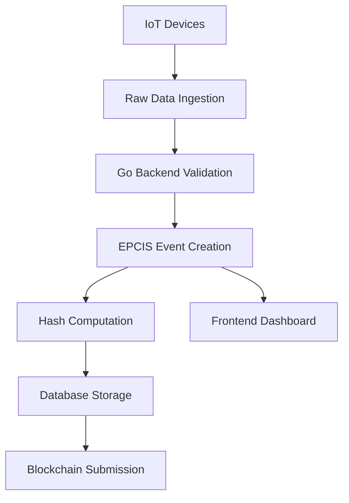
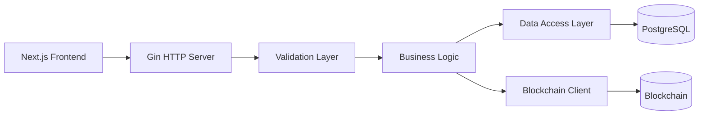

# Scain Architecture Overview

## 🏗️ System Architecture

Scain implements a modern microservices architecture designed for food traceability using **Go** backend services and **Next.js** frontend.

### Technology Stack

#### Backend (Go)
- **Runtime**: Go 1.21+
- **HTTP Framework**: Gin
- **Validation**: go-playground/validator
- **Logging**: logrus 
- **Configuration**: godotenv
- **Hashing**: Built-in crypto libraries

#### Frontend (Next.js)
- **Framework**: Next.js 14+ with App Router
- **Language**: TypeScript
- **Styling**: Tailwind CSS
- **UI Components**: shadcn/ui
- **State Management**: React hooks

#### Data Layer
- **Database**: PostgreSQL (planned)
- **Caching**: Redis (planned) 
- **Blockchain**: TBD (Hyperledger Fabric/Ethereum)

## 📦 Project Structure

```
scain/
├── backend/                    # Go backend service
│   ├── main.go                # Application entry point
│   ├── go.mod                 # Go dependencies
│   ├── models/                # Data models and structs
│   │   └── epcis.go          # EPCIS event models
│   └── utils/                 # Utility functions
│       ├── hash.go           # Cryptographic hashing
│       └── canonical.go      # Canonical JSON serialization
├── frontend/                   # Next.js frontend
│   ├── app/                   # Next.js App Router pages
│   ├── components/            # React components
│   └── lib/                   # Client utilities
└── docs/                      # Documentation
```

## 🔄 Data Flow Architecture

### EPCIS Event Processing



### API Architecture



## 🎯 Core Components

### Backend Services (Go)

#### EPCIS Event Manager
- **Purpose**: Handle supply chain traceability events
- **Models**: `EpcisEvent`, `SensorElement`, `DeviceMetadata`
- **Endpoints**: 
  - `POST /api/events` - Create new EPCIS event
  - `GET /api/events/:id` - Retrieve event by ID

#### Device Manager
- **Purpose**: Manage IoT device registration and metadata
- **Models**: `DeviceInfo`, `ClaimCode`
- **Endpoints**:
  - `POST /api/devices` - Register new device
  - `GET /api/devices/:deviceId` - Get device information
  - `POST /api/claim` - Claim device with code

#### Data Ingestion Service
- **Purpose**: Process raw IoT data into standardized events
- **Models**: `RawIngestPayload`
- **Endpoints**:
  - `POST /api/ingest` - Ingest raw device data

#### Utility Services
- **Hash Service**: Cryptographic hash computation for data integrity
- **Canonical JSON**: Deterministic JSON serialization for consistent hashing

### Frontend Components (Next.js)

#### Dashboard
- Real-time supply chain visibility
- Event timeline visualization
- Device status monitoring

#### Admin Interface
- Device management
- System configuration
- User administration

## 🔒 Security Architecture

### Data Integrity
- **SHA256 Hashing**: All events hashed for tamper detection
- **Canonical JSON**: Deterministic serialization ensures consistent hashes
- **Validation**: Go struct validation with tags

### Authentication & Authorization
- **JWT Tokens**: Stateless authentication (planned)
- **RBAC**: Role-based access control (planned)
- **Device Certificates**: IoT device authentication (planned)

## 🚀 Deployment Architecture

### Development
- **Go Backend**: `go run .` for development
- **Frontend**: `npm run dev` with hot reload
- **Concurrency**: Both services run simultaneously

### Production
- **Backend**: Compiled Go binary
- **Frontend**: Static site generation with Next.js
- **Containerization**: Docker containers (planned)
- **Orchestration**: Kubernetes/Docker Compose (planned)

## 📊 Performance Considerations

### Backend (Go)
- **Concurrency**: Native goroutines for high throughput
- **Memory**: Low memory footprint vs Node.js
- **CPU**: Compiled binary performance
- **Scalability**: Horizontal scaling ready

### Data Processing
- **Batch Processing**: For high-volume device data
- **Real-time Streaming**: Event-driven updates
- **Caching Strategy**: Redis for frequently accessed data

## 🔮 Future Architecture

### Planned Enhancements
- **Database Integration**: PostgreSQL with GORM
- **Message Queuing**: RabbitMQ/Kafka for event streaming  
- **Microservices**: Split into focused services
- **API Gateway**: Centralized routing and auth
- **Observability**: Metrics, logging, and tracing

### Blockchain Integration
- **Smart Contracts**: Event validation and storage
- **Consensus**: Ensure data immutability
- **Interoperability**: Cross-chain compatibility 